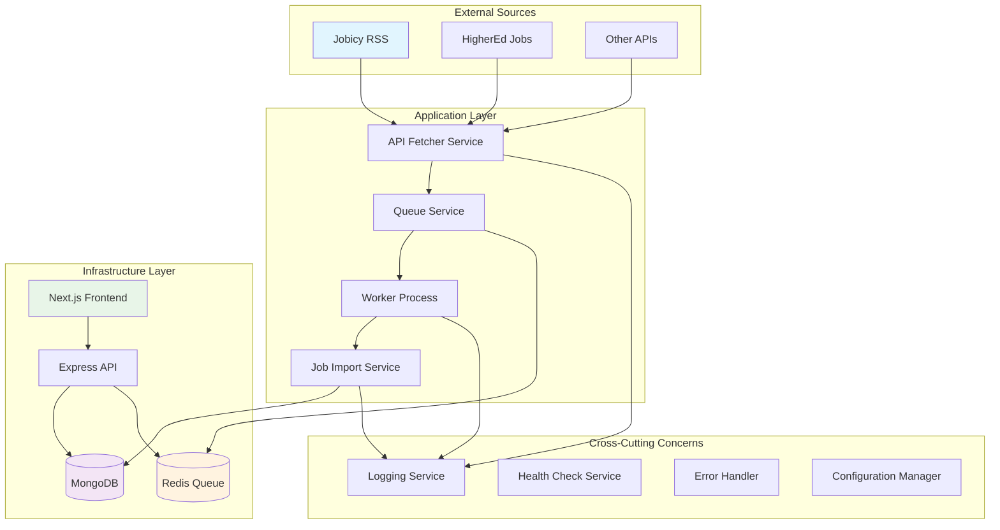
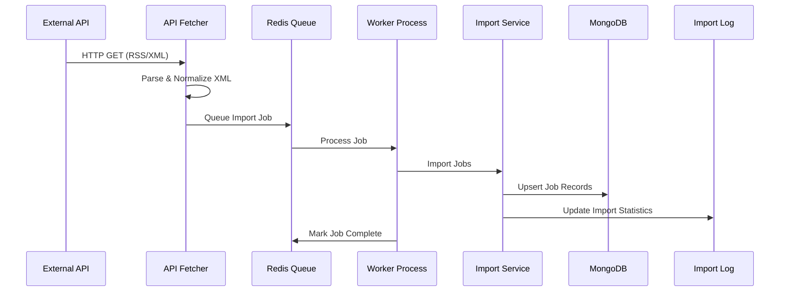
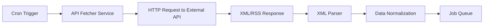
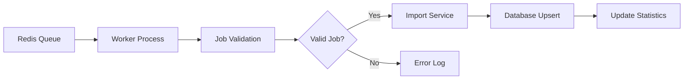
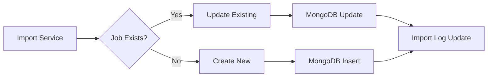
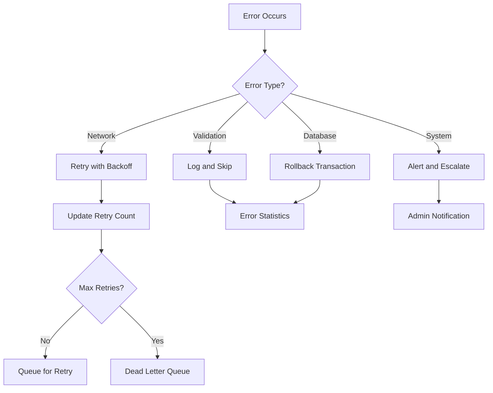
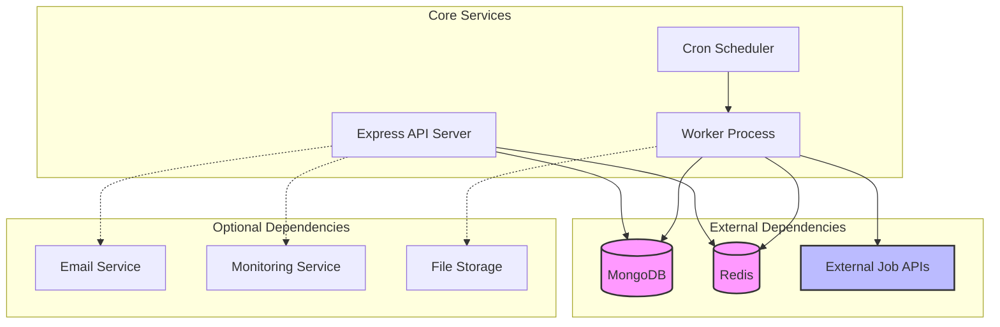
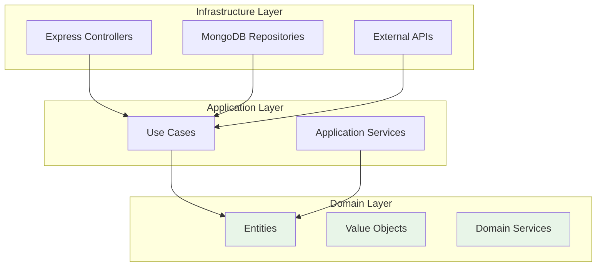

# 🏗️ Job Importer System Architecture

## Table of Contents

- [📋 System Overview](#-system-overview)
- [🔧 Core Components](#-core-components)
- [🎯 Design Decisions](#-design-decisions)
- [🏛️ Architecture Patterns](#️-architecture-patterns)
- [📊 Data Flow](#-data-flow)
- [🔗 Service Dependencies](#-service-dependencies)
- [⚡ Performance Considerations](#-performance-considerations)

## 📋 System Overview

The Job Importer System is designed as a **scalable, event-driven microservices-ready application** that processes job data from multiple external sources through a queue-based architecture.

### 🎯 Core Objectives

1. **Scalability** - Handle increasing load through horizontal scaling
2. **Reliability** - Ensure data consistency and error recovery
3. **Maintainability** - Clean, modular code with clear separation of concerns
4. **Performance** - Efficient processing of large job datasets
5. **Monitoring** - Comprehensive visibility into system health and performance

### 🌟 Key Characteristics

- **Event-Driven Architecture** - Asynchronous processing with message queues
- **Microservice-Ready** - Modular design that can evolve to distributed services
- **Database-Agnostic Core** - Clean abstraction layers for data access
- **Container-First** - Designed for Docker and Kubernetes deployment
- **API-First** - RESTful interfaces with OpenAPI documentation

## 🔧 Core Components

### System Architecture Diagram



### 🏛️ Component Breakdown

#### 1. **API Layer (Express.js)**
- **Responsibility**: HTTP request handling, routing, middleware
- **Key Features**:
  - RESTful API endpoints
  - Request validation and sanitization
  - Authentication and authorization
  - Rate limiting and CORS handling
  - Error handling and response formatting

#### 2. **Service Layer**
- **API Fetcher Service**: External API integration and data normalization
- **Job Import Service**: Business logic for job processing and storage
- **Queue Service**: Background job management and scheduling
- **Health Check Service**: System monitoring and diagnostics

#### 3. **Data Access Layer**
- **Models**: Mongoose schemas for MongoDB collections
- **Repositories**: Data access abstraction (future enhancement)

#### 5. **Infrastructure Layer**
- **MongoDB**: Primary data store for jobs and import logs
- **Redis**: Message queue and caching layer
- **Worker Processes**: Background job processors

#### 6. **Presentation Layer (Next.js)**
- **Dashboard**: Real-time monitoring interface
- **Components**: Reusable UI components

### 1. **Technology Stack Choices**

#### Backend: Node.js + Express.js

#### Database: MongoDB

#### Queue System: Redis + BullMQ

#### Frontend: Next.js + React


### 2. **Data Architecture**

#### Schema Design

```javascript
// Job Schema - Optimized for queries and flexibility
{
  _id: ObjectId,
  externalId: String,        // Indexed with source
  title: String,             // Indexed for search
  company: String,           // Indexed for filtering
  location: String,
  description: String,
  jobType: String,           // Indexed for filtering
  category: String,          // Indexed for filtering
  salary: String,
  url: String,
  publishedDate: Date,
  source: String,            // Indexed for grouping
  sourceUrl: String,
  isActive: Boolean,
  createdAt: Date,           // Indexed for sorting
  updatedAt: Date
}


#### Data Flow Architecture



## 📊 Data Flow

### 1. **Import Process Flow**

#### Phase 1: API Fetching


#### Phase 2: Queue Processing


#### Phase 3: Data Storage


### 2. **Error Handling Flow**



## 🔗 Service Dependencies

### Runtime Dependencies



### Startup Dependencies

1. **MongoDB** - Must be available before API server starts
2. **Redis** - Required for queue functionality
3. **Configuration** - Environment variables and config files
4. **External APIs** - Optional, graceful degradation if unavailable

### Failure Scenarios

| Component | Failure Impact | Mitigation Strategy |
|-----------|----------------|-------------------|
| MongoDB | Complete system failure | Retry logic, health checks, backup connections |
| Redis | Queue processing stops | Fallback to direct processing, Redis Sentinel |
| External APIs | Import jobs fail | Circuit breaker, retry with exponential backoff |
| Worker Process | Background processing stops | Multiple workers, automatic restart |

## ⚡ Performance Considerations

### 1. **Queue Performance**

#### Concurrency Configuration
```javascript
// Optimal worker configuration
const workerConfig = {
  concurrency: process.env.NODE_ENV === 'production' ? 10 : 3,
  maxStalledCount: 1,
  stalledInterval: 30000,
  retryProcessDelay: 5000
};

// Job processing optimization
class JobProcessor {
  async processJobs(jobs) {
    // Batch processing for better performance
    const batchSize = 50;
    const batches = this.chunk(jobs, batchSize);
    
    for (const batch of batches) {
      await Promise.all(batch.map(job => this.processJob(job)));
    }
  }
}
```

#### Memory Management
```javascript
// Efficient job data handling
const processJob = async (jobData) => {
  try {
    // Process in chunks to manage memory
    const result = await importService.processJobBatch(jobData);
    
    // Clean up references
    jobData = null;
    
    return result;
  } finally {
    // Force garbage collection in production
    if (global.gc) global.gc();
  }
};
```

### 2. **Caching Strategy**

#### Redis Caching
```javascript
// Cache frequently accessed data
class CacheService {
  async getJobStats() {
    const cacheKey = 'job:stats';
    let stats = await redis.get(cacheKey);
    
    if (!stats) {
      stats = await this.calculateJobStats();
      await redis.setex(cacheKey, 300, JSON.stringify(stats)); // 5 min cache
    }
    
    return JSON.parse(stats);
  }
}
```

#### Application-Level Caching
```javascript
// In-memory cache for configuration
class ConfigCache {
  private static cache = new Map();
  
  static get(key: string) {
    if (!this.cache.has(key)) {
      this.cache.set(key, this.loadConfig(key));
    }
    return this.cache.get(key);
  }
}
```


## 📚 Design Principles Applied


### 1. **Clean Architecture**



This architecture ensures:
- **Independence**: Domain layer has no external dependencies
- **Testability**: Business logic can be tested in isolation
- **Flexibility**: Infrastructure can be swapped without affecting business rules
- **Maintainability**: Clear separation of concerns and dependencies

---

## 📋 Summary

The Job Importer System architecture is designed for:

1. **Immediate Needs**: Reliable job import processing with monitoring
2. **Medium-term Growth**: Horizontal scaling and service decomposition
3. **Long-term Evolution**: Microservices and advanced ML features

The modular design, clear separation of concerns, and adherence to established patterns ensure the system can evolve from a simple job importer to a comprehensive job platform while maintaining reliability and performance.

**Key Architectural Strengths:**
- ✅ **Scalable**: Designed for horizontal scaling
- ✅ **Maintainable**: Clean code structure and patterns
- ✅ **Reliable**: Comprehensive error handling and monitoring
- ✅ **Flexible**: Easy to extend and modify
- ✅ **Observable**: Full visibility into system behavior

This architecture provides a solid foundation for current requirements while enabling future growth and feature enhancement.